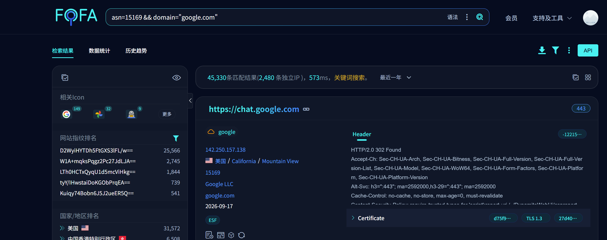
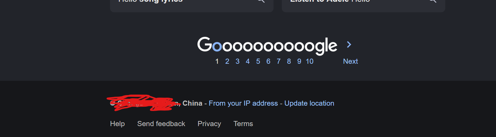
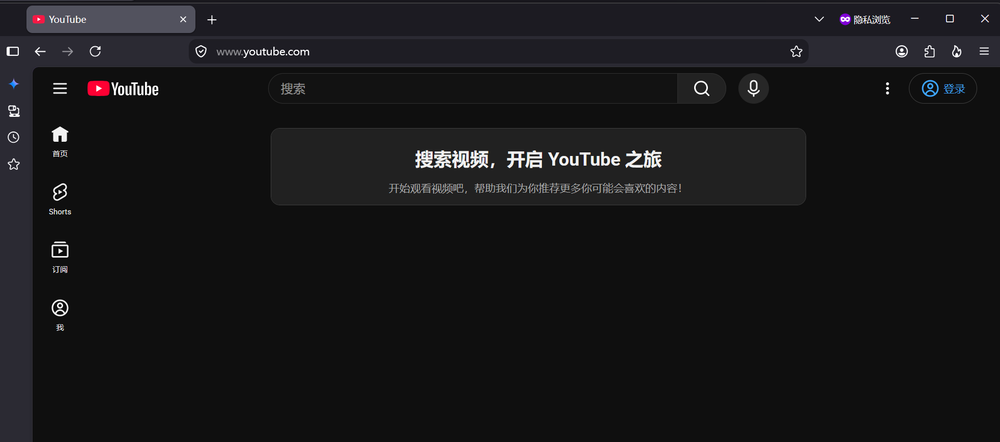

# quic反审查研究

## 目录

- [背景知识](#背景知识)
  - [QUIC](#quic)
  - [Reddit, Twitch](#reddit-twitch)
  - [Google](#google)
- [本人研究](#本人研究)
    - [想必看了上面的文章，你应该知道quic的工作原理以及使用之处](#想必看了上面的文章你应该知道quic的工作原理以及使用之处)
  - [首先](#首先)
  - [ip走向quic](#ip走向quic)
  - [实践](#实践)
    - [第一步：部署 DoH 服务端 (doh-server)](#第一步部署-doh-服务端-doh-server)
    - [第二步：绑定doh,打开浏览器(建议firefox)打开doh那边的配置，将面板显示的doh地址填入，并打开quic](#第二步绑定doh打开浏览器建议firefox打开doh那边的配置将面板显示的doh地址填入并打开quic)
    - [然后重启浏览器看看,输入google.com/ncr或者是youtube.com,你可能惊奇的发现已经直连上了！！！！](#然后重启浏览器看看输入googlecomncr或者是youtubecom你可能惊奇的发现已经直连上了)
    - [第三步：使用客户端工具扫描可用节点 (quic-google)](#第三步使用客户端工具扫描可用节点-quic-google)

## 背景知识

以下内容来自 [聊聊那些翻山越岭的神奇操作（下）-前篇](https://blog.kenxu.top/post/bypass-gfw-p3/)，作者 Ken。

### QUIC

中篇中提到，虽然 QUIC 在握手阶段不提供机密性，但防火墙在根据 QUIC 连接握手阶段的 SNI 信息阻断连接方面的能力较弱。也就是说，只要我们能与目标网站建立 QUIC 连接，就能绕过防火墙的阻断。为了做到这一点，必须要满足以下两个要求：

1. 网站本身必须支持 QUIC

2. 浏览器需要知道网站支持 QUIC，并在首次连接就使用 QUIC

对于第一点，虽说 QUIC 作为较新的协议仍未得到广泛支持，但好在部分国外 CDN 厂商已经对 QUIC 提供了支持，如果被封锁的网站部署在这些 CDN 上，就大概率支持 QUIC。那要怎样才能得知网站的支持情况呢？根据上文的介绍，我们可以通过观察网站的 HTTPS 记录和/或 HTTP 响应头中的 `alt-svc` 字段以确认。
虽说以上两点可以覆盖大多数网站，但依然存在部分支持 QUIC，但并未通过任何方式告知客户端的网站。对于这种情况，我们可以使用 cURL 进行测试，以 `reddit.com` 为例，使用以下指令强制使用 QUIC 与其建立连接：
```bash
curl https://www.reddit.com --http3-only -I
```
测试发现返回 200 状态码，证明网站确实支持 QUIC：

理想状态下，网站应为其域名添加 HTTPS 类型的解析记录并在 `alpn` 中包含 `h3`，否则仍然需要先建立 HTTP/2 连接再通过 `alt-svc` 升级到 HTTP/3。但这种常规的升级对被阻断的网站来说是致命的，毕竟在 TLS 握手阶段防火墙就会精准阻断连接，根本等不到升级那一步。
这种情况下，为了让浏览器直接通过 QUIC 与目标网站建立连接，我们需要自行搭建一个 DNS 转发器，手动为对应网站添加 HTTPS 类型记录，并将浏览器使用的 DNS 服务器指向我们自建的转发器。笔者使用的软件是 MosDNS（当然也有不少类似的软件，例如 SmartDNS）。软件本身虽然没有生成自定义 HTTPS 应答的功能，但可以将域名 A 的请求重定向到域名 B（通过插入 CNAME 记录），正巧笔者之前注册过一个 eu.org 提供的域名，所以笔者的实现方案是：将网站对应的 HTTPS 记录和 A/AAAA 记录添加到自己注册的域名上，查询对应网站的域名记录时直接重定向到这个域名上。这样的优点是：相比一条条写 DNS 解析记录（一个网站通常有多个子域名提供各类资源），这样可以利用软件自带的域名匹配规则为同一域名下的所有子域批量生成对应的 DNS 记录。说了这么多，接下来就拿几个网站举例。
### Reddit, Twitch
这两个网站均使用 Fastly 的 CDN 服务，特别注意 Fastly 与 Cloudflare 不同，单个网站有对应的一组 IP，不同网站之间 IP 不可混用。首先我们要找到这两个网站对应的正确 IP，并根据上文所述创建相应的 DNS 记录，这里我为两个网站创建的地址分别是 `reddit.kenxu.eu.org` 和 `twitch.kenxu.eu.org`，创建的 DNS 记录如下图所示：
**Reddit**

**Twitch**

如果有多个可用的 IPv4 和/或 IPv6 地址也可以添加多个。关于 HTTPS 记录中的 `no-default-alpn`，RFC 文档中的描述是：
> To determine the SVCB ALPN set, the client starts with the list of alpn-ids from the “alpn” SvcParamKey, and it adds the default set unless the “no-default-alpn” SvcParamKey is present.
也就是说，客户端在构建服务端支持的 ALPN 列表时，会包含 `alpn` 中的值和“默认值”（也就是 http/1.1），通过设置 `no-default-alpn` 可以排除默认的 http/1.1，从而让客户端认为服务端只支持 HTTP/3。
然后，根据 MosDNS 的文档，我们需要创建一个文件（假设文件名为 `redirect.txt`）并向其中写入网站对应的域名以及转发到的域名：
```text
domain:reddit.com reddit.kenxu.eu.org
domain:redd.it reddit.kenxu.eu.org
domain:redditmedia.com reddit.kenxu.eu.org
domain:twitch.tv twitch.kenxu.eu.org
```
然后在配置文件中加入以下配置：
```yaml
- tag: proxy_forward
    type: forward
    args:
      upstreams:
        - tag: cf
          addr: "tls://1.1.1.1"
          socks5: "127.0.0.1:7890"
  - tag: redirect
    type: redirect
    args:
      files:
        - ./redirect.txt
  - tag: main
    type: sequence
    args:
      - exec: $redirect # 注意 redirect 后必须有 forward，否则无法解析 CNAME
      - exec: $proxy_forward
```
启动 MosDNS，查询 Reddit 和 Twitch 域名对应的记录，应当看到查询结果被重定向至对应域名。如果你的 MosDNS 搭建在本地，记得去系统设置里将 DNS 地址改成 MosDNS 监听的本地地址。以 Firefox 为例（Chrome 的设置大同小异），在设置中将“HTTPS-Only 模式”更改为“在所有窗口启用 HTTPS-Only 模式”。如果你的 MosDNS 不在本地，你需要为其添加一个 HTTP 监听端口并配置 DoH 服务，之后在“基于 HTTPS 的 DNS”中启用“最大保护”并填入你自己的 DoH 地址。之后你就可以试着访问这两个网站了，见证奇迹的时刻。
### Google
首先我们需要简单了解 Google 系网站服务器的组成。总体来说，Google 大致有以下几类服务器：
- **GWS** - Google Web Service，提供 Google 系网站服务
- **GGC** - Google Global Cache，由 ISP 提供，旨在缓存 Google 系网站的资源以加速用户访问
- **GVS** - Google Video Server，提供 YouTube 上的视频资源分发服务
- **GCC** - Google China Cache，阉割版的 GGC，向中国大陆用户提供有限度的服务（例如 Chrome 和 Android Studio 软件包的分发以及广告服务）
1 和 2 的 IP 地址可以混用，也就是说，只要找到任意一个未被防火墙封禁的 GWS 或 GGC IP，即可将其套用到所有 Google 系网站上。而 3 则具有严格的对应关系，YouTube 上不同的视频资源不可套用同一个 IP。作为 QUIC 协议的主要开发者之一，Google 系网站对 HTTP/3 的支持情况如何呢？对于各类服务的域名，均能在 HTTP `alt-svc` 头中找到 `h3` 的身影，但 Google 只为其主域名 `www.google.com` 添加了 HTTPS 记录，其余域名均无相关记录：

GVS 的情况则截然相反，可以看得出来 Google 十分想让你在观看 YouTube 视频的时候使用 QUIC，甚至只有 `h3`：

很明显，我们需要仿照上文为 Google 系的网站添加 HTTPS 记录，不过在这之前还有一个问题需要解决：GWS 的 IP 基本已经被防火墙封锁殆尽，如何找到可用的 IP 地址呢？天无绝人之路，IPv4 被封了，我们还有 IPv6！查询 `www.google.com` 的 AAAA 记录可得：
```bash
$ dig www.google.com AAAA +short
2001:4860:4827:7700::
2001:4860:482d:7700::
...
```
可得到一系列 IPv6 地址。以第一个地址为例，虽然 DNS 记录的结果指向 `2001:4860:4827:7700:0000:0000:0000:0000`，但事实上，`2001:4860:4827:7700::/64` 这一整块地址均可用于访问 GWS，令人惊喜的是，防火墙对于 IPv6 依然采取封禁单个 IP 的策略。也就是说，我们只需要从这个 `/64` 段中任意挑选一个未被封锁的 IP 加入 DNS 记录中即可。同样，对于 GVS，虽然 IPv4 地址的情况与 GWS 相同，但 IPv6 大多幸免于难，加上已经存在的 HTTPS 记录，我们甚至不需要做什么就能正常加载 YouTube 上的视频资源。
也就是说，若想使用 QUIC 突破防火墙访问 Google 系网站，你的网络环境最好支持 IPv6。
接下来的事情就很简单了，仿照上文的例子添加对应的 DNS 记录，并将以下域名加入 `redirect.txt` 中：
```text
keyword:google.com google.kenxu.eu.org
domain:gstatic.com google.kenxu.eu.org
domain:googleapis.com google.kenxu.eu.org
domain:googleusercontent.com google.kenxu.eu.org
domain:youtube.com google.kenxu.eu.org
domain:ytimg.com google.kenxu.eu.org
domain:ggpht.com google.kenxu.eu.org
```
对于 GVS 所使用的域名 `*.googlevideo.com`，你可能还想让转发器屏蔽该域名的 IPv4 地址，仅返回 IPv6 地址：
```yaml
- matches:
      - qname domain:googlevideo.com
    exec: prefer_ipv6 # 同样注意加在 forward 之前
```

重启 MosDNS，打开浏览器见证奇迹吧。

## 本人研究

#### 想必看了上面的文章，你应该知道quic的工作原理以及使用之处

实现Google yt直连，前提是服务方支持quic，开放udp443端口，目前Google几乎全系支持quic

只需要让Google走向h3即可进行quic运作

### 首先

找到Google ip

去fofa搜,Google搜索的asn一般就行,当然证书记录搜也可以

 

然后拿来批量ping,哪个延迟低就用哪个

然后你就得到了可以用的ip(可解锁包括:YouTube 搜索 谷歌邮箱 等等)

### ip走向quic

前面的那个作者其实向我门演示了,他Reddit和Twitch是设置了优先h3的值,绑定了自己的域名,然后通过DNS重定向到网站，网站会以h3优先来达到quic服务


我这里方法和他不同，我这里是在vps搭建了类似于doh的服务

### 实践

本项目分为**服务端 (DoH Proxy)** 和**客户端 (QUIC 扫描与上报)** 两部分。我们首先需要在 VPS 上部署专属的 DoH 服务端。

#### 第一步：部署 DoH 服务端 (doh-server)

服务端的作用是接收你本地的 DNS 请求，并在命中 Google 视频域名时，直接返回我们扫描到的优选 QUIC 节点 IP。

1. **上传并解压**
   将 `doh-server.zip` 上传到你的海外 VPS，并解压：
   ```bash
   unzip doh-server.zip -d doh-server
   cd doh-server
   ```

2. **一键安装**
   赋予执行权限并以 root 身份运行安装脚本：
   ```bash
   chmod +x install.sh
   sudo ./install.sh
   ```

3. **根据提示完成配置**
   安装过程中，脚本会提示你输入 **Google 优选 IP**（注意：必须填写 IPv4 地址，不可为空。这个 IP 用于兜底解析普通的 Google 域名）。
   随后，脚本会自动安装 Node.js、配置 systemd 后台服务，并**随机生成一个 16 位的上报密钥 (Token)**。

4. **使用交互式控制面板**
   安装完成后，服务端会在后台持续运行。你可以在 VPS 终端随时输入以下命令唤出控制面板：
   ```bash
   quicgoogle
   ```
   在面板中，你可以：
   - 查看当前加载了多少个直连 IP 节点。
   - 按 `1` 获取**客户端所需填写的配置信息**（包含你的 DoH 代理地址、上报 API 地址、以及刚才生成的上报密钥）。
   - 按 `2` 随时更换 Google 优选 IP，系统会自动帮你重启服务，瞬间生效。

5. **配置反向代理 (推荐)**
   服务端默认在本地监听 `3053` 端口。为了供外部安全使用，建议使用 Caddy 或 Nginx 为其配置一个带有 TLS 证书的 HTTPS 反向代理。
   以 Caddy 为例 (`/etc/caddy/Caddyfile`)：
   ```caddyfile
   你的域名.com {
       # DoH 代理接口
       handle /doh/* {
           reverse_proxy 127.0.0.1:3053
       }
       # 节点上报接口
       handle /upload-map {
           reverse_proxy 127.0.0.1:3053
       }
   }
   ```
   配置完毕并重启 Caddy 后，你的 DoH 接口即为 `https://你的域名.com/doh/dns-query`，上报接口即为 `https://你的域名.com/upload-map`。

#### 第二步：绑定doh,打开浏览器(建议firefox)打开doh那边的配置，将面板显示的doh地址填入，并打开quic

服务端配置好并且域名反代生效后，我们需要在本地浏览器中绑定这个 DoH 地址。这里以 **Firefox (火狐浏览器)** 为例（最推荐，因为对 DoH 和 QUIC 的控制最精准）：

1. 打开 Firefox，在地址栏输入 `about:preferences` 进入设置页面。
2. 在左侧菜单点击 **“隐私与安全” (Privacy & Security)**。
3. 往下一直滚动，找到 **“基于 HTTPS 的 DNS” (DNS over HTTPS)** 模块。
4. 勾选 **“最大保护” (Max Protection)** 模式（这能强制浏览器必须走 DoH，防止本地 DNS 泄漏）。
5. 在“选择提供商”的下拉菜单中，选择 **“自定义” (Custom)**。
6. 在文本框中，填入你刚才在 VPS `quicgoogle` 面板里看到的 DoH 代理地址（例如：`https://你的域名.com/doh/dns-query`）。
7. **(关键防护)** 继续在“隐私与安全”页面滚动到底部，找到 **“HTTPS-Only 模式”**，选择 **“在所有窗口启用 HTTPS-Only 模式”**。这一步极其重要，能防止防火墙在明文 HTTP 握手升级阶段就提前阻断连接。
8. **(开启 QUIC)** 在 Firefox 地址栏新开一个标签页，输入 `about:config` 并回车，点击“接受风险并继续”。搜索 `network.http.http3.enable`，确保它的值是 **`true`**。

#### 然后重启浏览器看看,输入google.com/ncr或者是youtube.com,你可能惊奇的发现已经直连上了！！！！

 
 

#### 第三步：使用客户端工具扫描可用节点 (quic-google)

**在开始扫描之前，我们需要说明一下为什么必须要有这一步：**

你可能会发现，即便配置了 DoH 和 QUIC，打开 YouTube 主页虽然很快，但在点开具体视频时，视频可能依然在无限转圈。这是因为 YouTube 的视频实际是托管在 `googlevideo.com` 及其众多子域名下的，而这些域名不仅遭受了深度的 DNS 污染，其背后庞大的 **IPv4 地址池已经被 GFW 进行了针对性的黑名单封锁**（包括 IP 封锁或 SNI 阻断）。

> **补充说明：** 如果你的本地网络支持 IPv6，且强制解析走 IPv6，由于封锁难度大，大概率可以直接连上视频节点。但我们搭建的 DoH 服务目前主要走 IPv4。在 IPv4 受到严格黑名单封锁的大环境下，绝大多数常规解析出的 IPv4 节点是完全不可达的。

**这就是本工具存在的意义！** 我们需要通过自动化脚本，在海量的子域名和 IP 库中进行“大浪淘沙”，把那些**尚未被 GFW 封锁、依然可以直连的 IPv4 节点**给找出来，并让服务端强制把视频请求指向这些“漏网之鱼”。

**具体操作步骤如下：**

1. **下载与解压客户端**
   在你的本地电脑上下载 Releases 里的 `quic-google.zip` 压缩包，解压后你会得到包含扫描器 (`googlevideo_scanner.py`) 和上报器 (`upload_nodes.py`) 的文件夹。

2. **运行扫描器**
   确保你的电脑已安装 Python 3 环境。在解压出来的文件夹内打开命令行（终端），运行：
   ```bash
   python googlevideo_scanner.py
   ```
   启动后，程序会提示你输入 **DoH 服务地址**（如果你没有输入，默认走公用 DNS，推荐填入你自己第一步搭建的 DoH 地址以保证解析精准度）。随后，脚本将开启高并发模式，在本地测试各个节点的真实连通性。成功通过直连测试的 IP 会自动保存在 `googlevideo_success.txt` 中。

3. **上报优选节点至服务端**
   当你觉得扫出的可用节点数量足够多时，可以运行上报工具：
   ```bash
   python upload_nodes.py
   ```
   脚本会读取刚刚扫出的成功列表，并要求你输入：
   - **服务端上报 API**（例如：`https://你的域名.com/upload-map` 或 `http://VPS_IP:3053/upload-map`）
   - **上报认证密钥 (Token)**（你在第一步部署服务端时终端随机生成的密码）
   
   验证成功后，所有好用的直连 IP 会被瞬间推送到你的 VPS 服务端。**服务端会自动完成热更新并持久化保存，完全不需要重启！** 此时你再打开 YouTube，就会发现视频可以秒开了！
